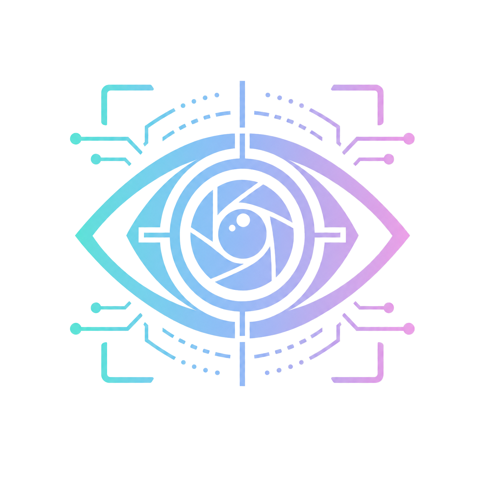

<p align="center">
  
</p>

<h1 align="center">AI 视觉对话助手</h1>

<p align="center">
  面向 K12 学习场景的 AI 视觉对话助手：看题、听题、引导学生自己想明白。
</p>

<p align="center">
  <a href="./LICENSE"></a>
  
  
  
  
</p>

## 演示视频

[七上安刚刚发布的视频 https://b23.tv/h2JMfAr](https://b23.tv/h2JMfAr)

## 项目简介

AI 视觉对话助手是一个企业命题实践项目，目标是开发一款能打开摄像头与麦克风、理解画面和语音并自然回复的 AI 对话应用。

项目当前聚焦“学习助手”场景：学生把题目放在摄像头前，用语音提问。应用会在语音开始时截取当前画面，支持用户框选题目区域，只把关键区域交给视觉模型，减少无关背景干扰和视觉 token 成本。AI 的回答不直接给最终答案，而是通过提问、提示和追问引导学生理解题目。

## 功能亮点

- **视觉 + 语音一体化交互**：摄像头实时预览、麦克风监听、ASR、视觉转写、流式回答和 TTS 播放串成完整链路。
- **题目区域框选**：支持鼠标/触摸拖拽框选题目或答题区域，避免上传整张画面。
- **视觉转写与回答解耦**：DashScope 负责图片客观转写，DeepSeek 结合语音文本、图片转写和上下文生成最终学习引导。
- **端侧 VAD**：在浏览器和 Android 端判断语音开始与结束，减少静音上传和无效调用。
- **流式体验**：AI 回复实时显示，TTS 按句合成播放，降低等待感。
- **学习助手 Prompt**：默认不直接给答案，每轮只给一步提示，鼓励学生自己思考。
- **成本控制策略**：单帧截图、区域裁剪、图片压缩、历史摘要、音频缓存重播和 API Key 本地代理。
- **Web + Android 双端实现**：Web 端用于快速验证交互，Android 端提供原生移动端体验。

## 技术栈

| 模块 | 实现 |
| --- | --- |
| Web 前端 | React 19、TypeScript、Vite |
| Web 端 VAD | `@ricky0123/vad-web`、`onnxruntime-web` |
| 图像处理 | Canvas 裁剪、JPEG 压缩、`browser-image-compression` |
| 语音识别 | DashScope `qwen3-asr-flash` |
| 图片转写 | DashScope `qwen-vl-plus` |
| 对话生成 | DeepSeek `deepseek-v4-flash` |
| 语音合成 | DashScope `qwen3-tts-flash` |
| Android 客户端 | Java、Camera/TextureView、AudioRecord、原生 UI |

## 快速开始

### Web 版本

```bash
npm install
copy .env.example .env
npm run dev
```

在 `.env` 中填写：

```env
DASHSCOPE_API_KEY=sk-your-key-here
DEEPSEEK_API_KEY=sk-your-key-here
```

打开 Vite 输出的本地地址，并允许摄像头与麦克风权限。Web 版本通过 Vite 本地代理调用 DashScope 和 DeepSeek，API Key 不会暴露给浏览器前端代码；如果要部署到公网，需要额外准备后端代理。

### Android 版本

用 Android Studio 打开 [android-redesign](./android-redesign)，然后在 `local.properties` 中配置：

```properties
DASHSCOPE_API_KEY=sk-your-key-here
DEEPSEEK_API_KEY=sk-your-key-here
```

同步 Gradle 后运行 `app` 配置即可。

## 项目结构

```text
.
├── src/                    # Web 应用源码
│   ├── components/          # 摄像头、对话气泡、状态栏、Toast
│   ├── hooks/               # Camera、VAD、ASR、对话、TTS、聊天状态
│   ├── services/            # ASR、视觉转写、DeepSeek、TTS、图片处理
│   └── utils/               # 常量、摘要、音频、错误处理
├── public/                  # VAD / ONNX 运行资源
├── android-redesign/        # 原生 Android 实现
├── DESIGN.md                # 设计文档
├── 项目图标（透明）.png
└── README.md
```

## 设计文档

设计文档包含：

- 计划实现与最终实现的用户故事
- 视觉理解和语音交互设计
- 端云协同与运营成本控制策略
- 已知限制和后续优化方向

详见 [DESIGN.md](./DESIGN.md)。

## 第三方依赖与原创实现说明

本项目使用了 React、Vite、TypeScript、`@ricky0123/vad-web`、`onnxruntime-web`、`browser-image-compression`、Android Gradle Plugin、DashScope API 和 DeepSeek API。

原创实现部分包括：

- 学习助手式交互流程与 Prompt 设计
- 摄像头题目区域框选交互
- Web 端 `object-fit: cover` 坐标映射裁剪
- 语音开始时自动截图
- 图片转写与最终回答分层
- 对话历史规则摘要压缩
- 按句流式 TTS 播放
- AI 朗读时暂停麦克风监听，降低回声误触发
- 原生 Android Camera / AudioRecord / SelectionOverlay 集成

## 提交说明

本仓库采用 PR 分步提交。功能被拆成多个小分支和 Pull Request，便于评审查看开发过程、实现范围和验证方式。
